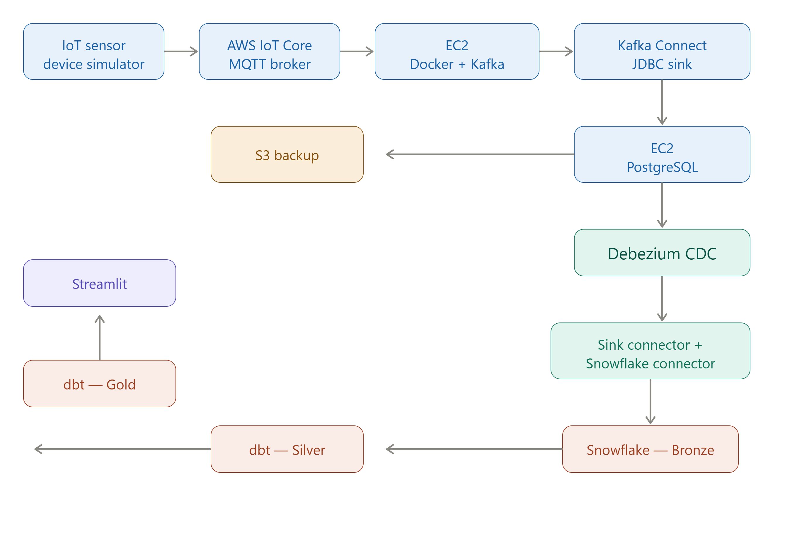
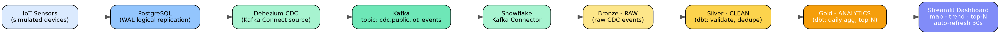

# IoT Data Engineering Hackathon — On-Prem to Cloud Pipeline



**Instructor:** Qasim Hassan &nbsp;•&nbsp; **Batch:** 03

Simple, linear pipeline: simulated IoT sensors → PostgreSQL (on-prem sim) →
**Debezium CDC** → **Kafka** → **Snowflake** (Bronze/Silver/Gold via **dbt**) →
**Streamlit** dashboard.



---

## 1. Repository layout

```
hackathon-iot-pipeline/
├── architecture/                 # architecture.dot + rendered PNG/SVG
├── phase1-aws-cdk/               # AWS CDK (Python) IaC: VPC, MSK, EC2, S3, Secrets Manager
│   ├── app.py
│   ├── stacks/
│   └── iot-device-simulator/     # AWS IoT Device Simulator template
├── phase1-postgres/init.sql      # Postgres schema + WAL/publication setup
├── kafka-connect/                # Local runnable Kafka+Connect stack
│   ├── docker-compose.yml
│   ├── connectors/*.json         # Debezium, Snowflake, JDBC, S3 sink configs
│   └── register_connectors.sh
├── iot-simulator/simulate_devices.py   # Local telemetry generator
├── snowflake/*.sql               # Database/schema/warehouse/role setup
├── dbt_project/                  # Medallion architecture: bronze/silver/gold
└── streamlit_app/                # Gold-layer dashboard
```

---

## 2. Architecture summary

**Phase 1 — Ingestion (on-prem simulation on AWS)**
`IoT Sensors → AWS IoT Core (MQTT) → Kafka MSK (iot-events) → Kafka Connect
JDBC Sink → PostgreSQL EC2` (+ optional `Kafka S3 Sink → S3 backup`)

**Phase 2 — CDC, Warehouse, Analytics**
`PostgreSQL (WAL) → Debezium CDC → Kafka MSK (cdc.public.iot_events) →
Snowflake Kafka Connector → Snowflake Bronze (RAW) → dbt Silver (CLEAN) →
dbt Gold (ANALYTICS) → Streamlit`

Medallion mapping used throughout: **Bronze = RAW schema, Silver = CLEAN schema,
Gold = ANALYTICS schema.**

---

## 3. Quick start — run the CDC → Snowflake → dbt → Streamlit path locally

You do not need a live AWS account to prove out and demo Phase 2. This spins
up Kafka, Postgres and Kafka Connect locally with Docker, and streams real
CDC events into your (free-tier) Snowflake account.

### 3.1 Prerequisites
- Docker + Docker Compose
- Python 3.10+
- A Snowflake account (free trial is fine)
- `pip install psycopg2-binary dbt-snowflake`

### 3.2 Connector plugin jars
Kafka Connect needs these plugin jars dropped into `kafka-connect/plugins/`
before starting (not committed to git — download separately):

| Plugin | Source |
|---|---|
| Debezium PostgreSQL connector | bundled in the `debezium/connect:2.6` image already |
| Snowflake Kafka Connector | Maven Central: `com.snowflake:snowflake-kafka-connector` |
| Confluent JDBC Sink (Phase 1) | Confluent Hub: `confluentinc/kafka-connect-jdbc` |
| Confluent S3 Sink (Phase 1 optional) | Confluent Hub: `confluentinc/kafka-connect-s3` |

```bash
mkdir -p kafka-connect/plugins
# download/unzip each plugin's jars into kafka-connect/plugins/<plugin-name>/
```

### 3.3 Bring up the local stack
```bash
cd kafka-connect
docker compose up -d
docker compose ps        # wait until postgres + kafka-connect are healthy
```
Kafka UI is available at http://localhost:8080 to browse topics/connectors.

### 3.4 Set up Snowflake
```bash
snowsql -f ../snowflake/01_setup_database_schemas.sql
snowsql -f ../snowflake/02_create_bronze_table.sql
```
Generate a key pair for the Kafka connector's key-pair auth and set the
public key on `HACKATHON_SVC_USER` (see Snowflake docs: "Key Pair
Authentication"). Paste the private key into
`kafka-connect/connectors/snowflake-sink.json`.

### 3.5 Register the connectors
```bash
cd kafka-connect
./register_connectors.sh
# Verify:
curl http://localhost:8083/connectors
curl http://localhost:8083/connectors/debezium-postgres-iot-source/status
curl http://localhost:8083/connectors/snowflake-iot-bronze-sink/status
```

### 3.6 Start streaming simulated telemetry
```bash
cd ../iot-simulator
pip install psycopg2-binary
python simulate_devices.py --devices 5 --interval 2
```
Every insert into Postgres is picked up by Debezium via the WAL, published
to `cdc.public.iot_events`, and landed into Snowflake `RAW.IOT_EVENTS`
within seconds. Confirm with:
```sql
select count(*) from HACKATHON_IOT.RAW.IOT_EVENTS;
```

### 3.7 Run dbt (Bronze → Silver → Gold)
```bash
cd ../dbt_project
cp profiles.yml.example ~/.dbt/profiles.yml   # fill in credentials, or use env vars
export SNOWFLAKE_ACCOUNT=... SNOWFLAKE_USER=... SNOWFLAKE_PASSWORD=...
dbt deps          # installs dbt_utils
dbt run           # builds silver_iot_events, gold_daily_device_agg, gold_top_devices
dbt test          # all tests should pass
dbt docs generate && dbt docs serve   # view Bronze -> Silver -> Gold lineage graph
```

### 3.8 Launch the Streamlit dashboard
```bash
cd ../streamlit_app
pip install -r requirements.txt
cp .streamlit/secrets.toml.example .streamlit/secrets.toml   # fill in credentials
streamlit run app.py
```
Open http://localhost:8501 — device activity map, AQI time-series trend, and
top-N devices table, auto-refreshing every 30 seconds.

---

## 4. Deploying Phase 1 to real AWS (CDK)

```bash
cd phase1-aws-cdk
python3 -m venv .venv && source .venv/bin/activate
pip install -r requirements.txt
cdk bootstrap aws://<ACCOUNT_ID>/eu-west-2
cdk deploy --all --context region=eu-west-2 --context account=<ACCOUNT_ID>
```
This provisions: VPC (public + private subnets), MSK cluster, PostgreSQL EC2
(private subnet, no public IP), Bastion EC2 (SSM Session Manager only, no
SSH keys), Secrets Manager secret for DB credentials, Kafka Connect EC2
worker, and an S3 backup bucket.

Then:
1. Deploy the **AWS IoT Device Simulator** (see `phase1-aws-cdk/iot-device-simulator/device_template.json`) and create the IoT Core rule routing `iot/geo-events` → MSK topic `iot-events`.
2. Install connector plugins on the Kafka Connect EC2 instance and register `jdbc-sink-postgres.json` and `s3-sink-backup.json` (Phase 1), then `debezium-postgres-source.json` and `snowflake-sink.json` (Phase 2) via the same `register_connectors.sh` script pointed at the EC2 instance's Connect REST endpoint.
3. Connect to Postgres/bastion via SSM: `aws ssm start-session --target <bastion-instance-id>`.

---

## 5. Task-by-task checklist

| Task | Where |
|---|---|
| 1.1 AWS account, CLI, CDK, MSK | `phase1-aws-cdk/stacks/msk_stack.py` |
| 1.2 IoT Device Simulator, 5+ devices, IoT Core rule | `phase1-aws-cdk/iot-device-simulator/device_template.json` |
| 1.3 Kafka Connect, JDBC Sink, Secrets Manager, S3 Sink | `kafka-connect/connectors/jdbc-sink-postgres.json`, `s3-sink-backup.json` |
| 1.4 Postgres EC2 private subnet, WAL, Bastion, SSM | `phase1-aws-cdk/stacks/kafka_connect_stack.py`, `phase1-postgres/init.sql` |
| 1.5 CDK deploy, end-to-end verification | `phase1-aws-cdk/app.py` |
| 2.1 Debezium CDC setup | `kafka-connect/connectors/debezium-postgres-source.json` |
| 2.2 Snowflake + Kafka Connector, Bronze table | `snowflake/01_*.sql`, `snowflake/02_*.sql`, `kafka-connect/connectors/snowflake-sink.json` |
| 2.3 dbt Silver + Gold models, tests, docs | `dbt_project/models/silver`, `dbt_project/models/gold` |
| 2.4 Streamlit dashboard, 3 charts, 30s refresh | `streamlit_app/app.py` |

---

## 6. Design notes / optimizations

- **Medallion boundaries kept strict**: Bronze is append-only raw VARIANT
  (fast Kafka Connector writes, zero transformation on the hot path), Silver
  does all cleansing/dedup/typing, Gold is business-ready aggregates only —
  Streamlit never queries Bronze/Silver directly.
- **Incremental Silver model** (`is_incremental()`) avoids re-scanning the
  entire Bronze history on every dbt run — only new Kafka-ingested rows are
  processed, keeping warehouse compute (and cost) low as the CDC stream grows.
- **CDC dedup via `ROW_NUMBER()`** over `(device_id, kafka_partition,
  kafka_offset)` guards against Kafka Connect's at-least-once delivery
  producing duplicate Bronze rows.
- **`REPLICA IDENTITY FULL`** on the source table ensures Debezium UPDATE/DELETE
  events carry full before/after row images, not just primary keys — needed
  because the Silver model re-derives `severity` rather than trusting Bronze.
- **Auto-suspending XSMALL warehouse** in Snowflake keeps compute cost near
  zero between dbt runs and dashboard queries.
- **No SSH keys anywhere** — Bastion and app EC2 instances are reached only
  via AWS SSM Session Manager, and DB credentials live in Secrets Manager,
  never in code or CDK context.

---

## 7. Submission checklist

- [x] GitHub-ready repo with all code (CDK stacks, Kafka Connect configs, dbt models, Streamlit app)
- [x] Architecture diagram covering both phases (`architecture/architecture_diagram.png`, `.svg`, `.dot` source)
- [ ] Screenshots of every deliverable (add your own from your run)
- [x] This README with setup steps and how to run the full pipeline
- [ ] 5-minute demo recording (live CDC event: Postgres → Snowflake Gold)
