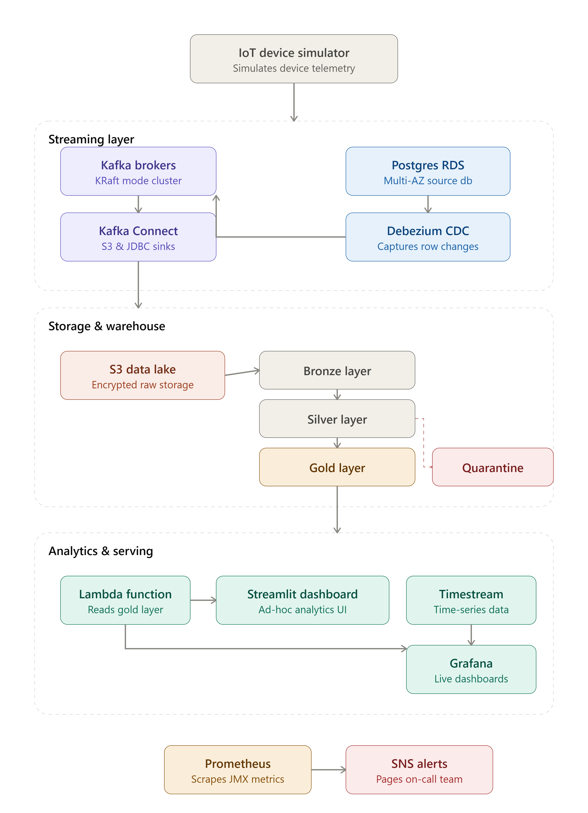

# 📡 Enterprise IoT Streaming Platform



An end-to-end, production-grade Data Engineering platform designed to ingest, process, clean, store, monitor, and visualize high-throughput IoT telemetry streams in real-time. Built as a real-world enterprise infrastructure blueprint.

## 🌟 Key Architecture & Features

This project utilizes a modern distributed streaming and database architecture, implementing the **Medallion Data Architecture** using dbt and Snowflake, real-time change data capture (CDC), and complete system observability.

* **Infrastructure as Code (IaC)**: Configured fully via Python AWS CDK stacks, segregating credentials into a dedicated [SecretsStack](file:///e:/Hackathon/Hackathon/iot-streaming-platform/iot-streaming-platform/infrastructure/infrastructure/secrets_stack.py) from the core resource provisions in [InfrastructureStack](file:///e:/Hackathon/Hackathon/iot-streaming-platform/iot-streaming-platform/infrastructure/infrastructure/infrastructure_stack.py).
* **Distributed Stream Ingestion**: Self-hosted 2-broker KRaft Kafka cluster. Deploys Dockerized Kafka Connect nodes running Debezium, JDBC S3 Sink, and JDBC relational database sinks.
* **Reliable IoT Simulator**: Simulates 100+ active devices with schema validation, backpressure management, error-handling retry buffers, and a dead-letter queue.
* **Logical Change Data Capture (CDC)**: Leverages PostgreSQL Write-Ahead Logs (`pgoutput`) with Debezium to stream DML operations back into Kafka.
* **Medallion Warehouse Architecture**: Establishes Bronze (Staging), Silver (Cleaned & Validated), and Gold (KPI Aggregations & Anomalies) databases in Snowflake.
* **Data Quality & Quarantine Routing**: Employs central dbt macro validation to quarantine anomalous/bad rows into dedicated inspection tables without stalling streaming streams.
* **Live Dashboards & Observability**: Renders interactive metrics using a Streamlit app and Grafana querying Amazon Timestream, complete with Prometheus JMX scrapes.

---

## 🗺️ System Architecture

```mermaid
flowchart LR
    Sim["IoT Simulator"] -->|Kafka Telemetry| Kafka["KRaft Kafka Cluster"]
    Kafka -->|JDBC Sink| PG["RDS PostgreSQL"]
    PG -->|CDC Logs (Debezium)| Kafka
    Kafka -->|Snowflake Ingest| Snowflake["Snowflake Medallion (dbt)"]
    Snowflake -->|Gold Tables| Streamlit["Streamlit UI"]
    Snowflake -->|Lambda| Timestream["Amazon Timestream"]
    Timestream -->|Time Series| Grafana["Grafana Dashboard"]
```

> See the full diagram and details in [docs/architecture.md](file:///e:/Hackathon/Hackathon/iot-streaming-platform/iot-streaming-platform/docs/architecture.md).

---

## 🛠️ Repository Directory Map

Here is the directory structure of the repository:

* **[connectors/](file:///e:/Hackathon/Hackathon/iot-streaming-platform/iot-streaming-platform/connectors)**: Docker-compose setup for Kafka Connect and sink connector configuration profiles.
* **[dashboards/](file:///e:/Hackathon/Hackathon/iot-streaming-platform/iot-streaming-platform/dashboards)**: Grafana dashboard layouts.
* **[dbt/](file:///e:/Hackathon/Hackathon/iot-streaming-platform/iot-streaming-platform/dbt)**: Medallion transformations (`models/`), custom testing files (`tests/`), validation profiles, and configuration parameters.
* **[debezium/](file:///e:/Hackathon/Hackathon/iot-streaming-platform/iot-streaming-platform/debezium)**: Debezium connector registration and verification setup.
* **[docs/](file:///e:/Hackathon/Hackathon/iot-streaming-platform/iot-streaming-platform/docs)**: [System Architecture Design](file:///e:/Hackathon/Hackathon/iot-streaming-platform/iot-streaming-platform/docs/architecture.md) and [Operational Runbook](file:///e:/Hackathon/Hackathon/iot-streaming-platform/iot-streaming-platform/docs/runbook.md).
* **[infrastructure/](file:///e:/Hackathon/Hackathon/iot-streaming-platform/iot-streaming-platform/infrastructure)**: CDK stacks defining AWS VPCs, EC2 clusters, RDS PostgreSQL, Security Groups, IAM Roles, KMS keys, and Secrets.
* **[kafka/](file:///e:/Hackathon/Hackathon/iot-streaming-platform/iot-streaming-platform/kafka)**: Provisioning and testing shell scripts.
* **[lambda/](file:///e:/Hackathon/Hackathon/iot-streaming-platform/iot-streaming-platform/lambda)**: AWS Lambda function transferring Snowflake Gold KPIs to Amazon Timestream.
* **[monitoring/](file:///e:/Hackathon/Hackathon/iot-streaming-platform/iot-streaming-platform/monitoring)**: CloudWatch configuration scripts, Prometheus rules, and Alertmanager routing setups.
* **[postgres/](file:///e:/Hackathon/Hackathon/iot-streaming-platform/iot-streaming-platform/postgres)**: PostgreSQL database schemas and initialization scripts.
* **[producer/](file:///e:/Hackathon/Hackathon/iot-streaming-platform/iot-streaming-platform/producer)**: Python IoT simulation code and Docker container specifications.
* **[snowflake/](file:///e:/Hackathon/Hackathon/iot-streaming-platform/iot-streaming-platform/snowflake)**: Snowflake SQL schema creation templates.
* **[streamlit/](file:///e:/Hackathon/Hackathon/iot-streaming-platform/iot-streaming-platform/streamlit)**: Streamlit Python web dashboard scripts.

---

## 🚀 Quick Start Guide

To initialize the platform, run the CDK deployment, setup the database, initialize the Kafka connectors, start the producer, and execute dbt compile runs.

Detailed instructions on provisioning infrastructure, configuring connector profiles, and running operational checks are in the [Operational Runbook (docs/runbook.md)](file:///e:/Hackathon/Hackathon/iot-streaming-platform/iot-streaming-platform/docs/runbook.md).
