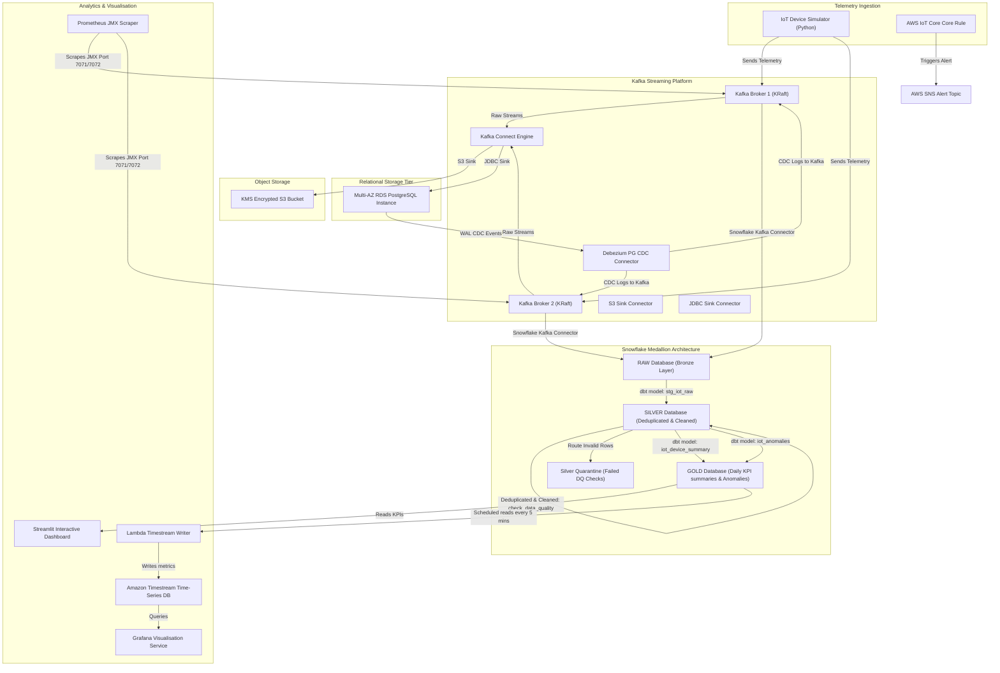

# IoT Streaming Platform — Production Architecture

This document details the real-time production-ready architecture of the **IoT Streaming Platform**. The platform processes telemetry data from simulated devices, performs ingestion, stream processing, long-term warehousing, and serves it to dashboards with data quality validations and monitoring.

## System Architecture Diagram

## Architectural Stages and Ingestion Flow

1. **Stage 1 (AWS Foundation)**: Deploys core security services, including **AWS Key Management Service (KMS)** and **SNS Alert Topics** for notifying engineers.
2. **Stage 2 (Networking & Security)**: Implements a 3-tier Private VPC layout restricting RDS & Kafka Connect instances to private subnets without public internet ingress.
3. **Stage 3 (Infrastructure as Code)**: Declares all components in standard python AWS CDK for reproducible deployments.
4. **Stage 4 & 5 (Kafka & IoT)**: Configures a 2-broker Kraft cluster processing incoming payload from the simulator generating telemetry.
5. **Stage 6 (PostgreSQL)**: Handles relational metadata registry and processing logs with optimized query performance.
6. **Stage 7 & 8 (Kafka Connect & S3)**: Moves raw message streams to AWS S3 storage under Hive partitions and sinks to PostgreSQL database.
7. **Stage 9 (Debezium CDC)**: Monitors PostgreSQL write-ahead logs (WAL) to emit change events back to Kafka.
8. **Stage 10, 11 & 12 (Snowflake & dbt & DQ)**: Transforms raw JSON events using medallion modeling (Bronze -> Silver -> Gold). Reusable data quality rules isolate bad rows into the Quarantine table.
9. **Stage 13 & 14 (Streamlit, Lambda & Grafana)**: Builds high-performance charts, maps, and Grafana dashboards for user consumption.
10. **Stage 15 & 16 (Monitoring & Hardening)**: Leverages Prometheus and Alertmanager to scrape JMX JRE process metrics alongside automated GitHub Actions pipelines.
